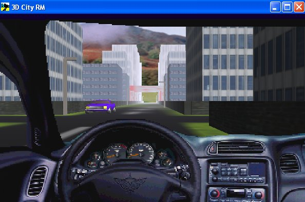



## City3D

### Description

This is a 3D real time environment

application using Direct3DRM.See the Readme.txt file, please.

DirectX7 needed.

For other vb games and demos visit my web site: http://web.tiscali.it/fc_vbgames/index.html
 
### More Info
 

             |
---                |---
**Submitted On**   |2002-09-05 10:11:38
**By**             |[fabio calvi](https://github.com/Planet-Source-Code/PSCIndex/blob/master/ByAuthor/fabio-calvi.md)
**Level**          |Advanced
**User Rating**    |4.9 (202 globes from 41 users)
**Compatibility**  |VB 6\.0
**Category**       |[DirectX](https://github.com/Planet-Source-Code/PSCIndex/blob/master/ByCategory/directx__1-44.md)
**World**          |[Visual Basic](https://github.com/Planet-Source-Code/PSCIndex/blob/master/ByWorld/visual-basic.md)
**Archive File**   |[City3D127766962002\.zip](https://github.com/Planet-Source-Code/fabio-calvi-city3d__1-38733/archive/master.zip)

